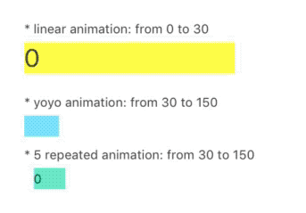

# ValueAnimator

[](https://travis-ci.org/brownsoo/ValueAnimator)
[](http://cocoapods.org/pods/ValueAnimator)
[](http://cocoapods.org/pods/ValueAnimator)
[](http://cocoapods.org/pods/ValueAnimator)
[](https://codebeat.co/projects/github-com-brownsoo-valueanimator-master)

- [ ] Multiple properties in funcion 'onChanged'

## Demo



## Usage

ValueAnimator makes the transition from initial value to target value using easing functions.

#### Simple animation

```swift
let animator = ValueAnimator.animate("some", from: 0, to: 360, duration: 1.0,
    onChanged: { p, v in 
        print("property \(p): \(v.value)")
    },
    easing: EaseCircular.easeIn())
animator.resume()
```

#### Yoyo annimation with 2 values

```swift
let yoyoAni = ValueAnimator.animate(
    props: ["h", "w"], 
    from: [20, 30], 
    to: [5, 150], 
    duration: 1.4, 
    easing: EaseSine.easeInOut(), 
    onChanged: { p, v in
        if p == "h" {
            let width = self.rect1.bounds.width
            self.rect1.frame = CGRect(x: 24, y: 140, width: width, height:v.cg)
        } else {
            let height = self.rect1.bounds.height
            self.rect1.frame = CGRect(x: 24, y: 140, width:v.cg, height: height)
        }
    }, 
    option: ValueAnimator.OptionBuilder()
        .setYoyo(true)
        .build())
yoyoAni.resume()
```


#### Thread

ValueAnimator uses its own work-thread. But the callback `changeCallback`, `endCallback` is called in main-thread. if you wanna it called in work-thread, you just set the 'callbackOnMainThread' property is false.

```swift
let someView: UIView!
let animator = ValueAnimator.animate("some", from: 0, to: 1, duration: 1.0,
    onChanged: { p, v in 
        // called in ValueAnimator's work-thread
    },
    easing: EaseCircular.easeIn())
animator.callbackOnMainThread = false
animator.resume()
```

## Example

To run the example project, clone the repo, and run **open ValueAnimator.xcworkspace**. 
You can see ValueAnimatorExample project.

## Installation

### [CocoaPods](http://cocoapods.org)

Simply add the following line to your Podfile:

```ruby
pod 'ValueAnimator'
```

### [Swift Package Manager](https://swift.org/package-manager/)

* Open Xcode
* Go to File > Swift Packages > Add Package Dependency...
* Paste this Github Repo URL (https://github.com/brownsoo/ValueAnimator) into the search bar.
* Select the SwURL repo from the search results.


## Author

brownsoo, [@hansoo.labs](https://twitter.com/hansoolabs)

## License

ValueAnimator is available under the MIT license. See the LICENSE file for more info.
